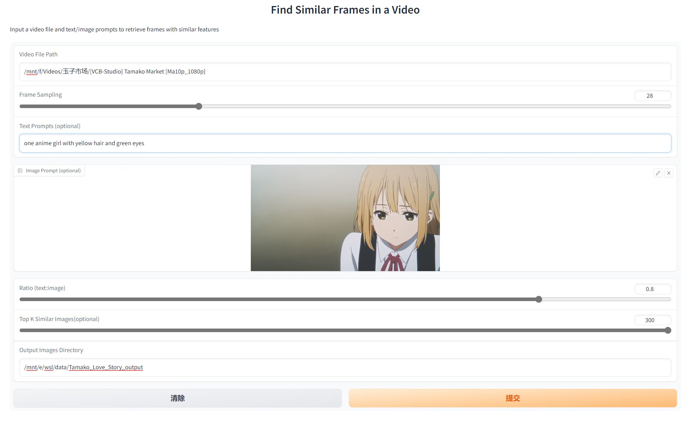
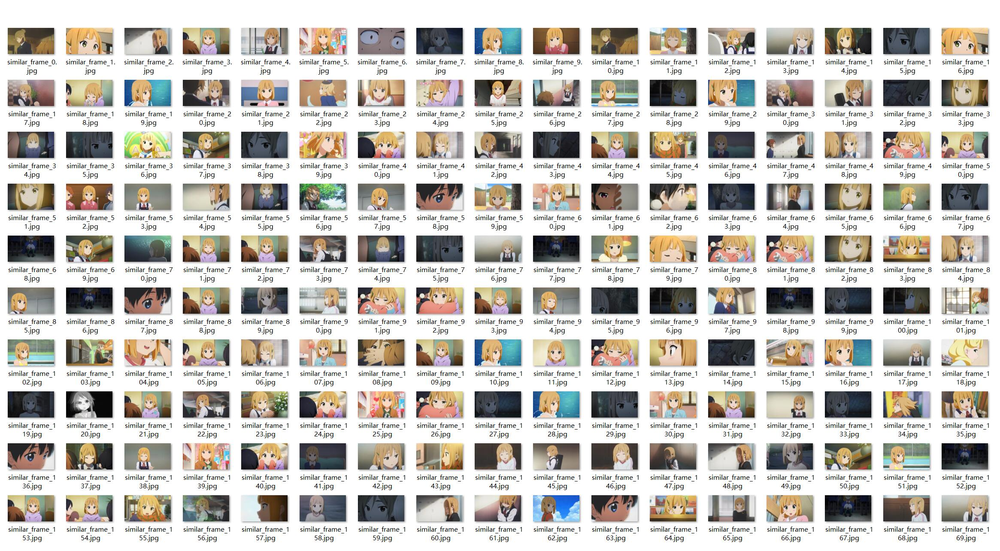
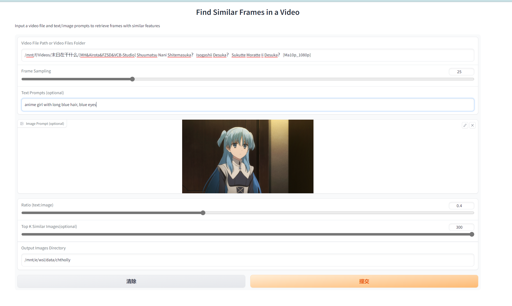
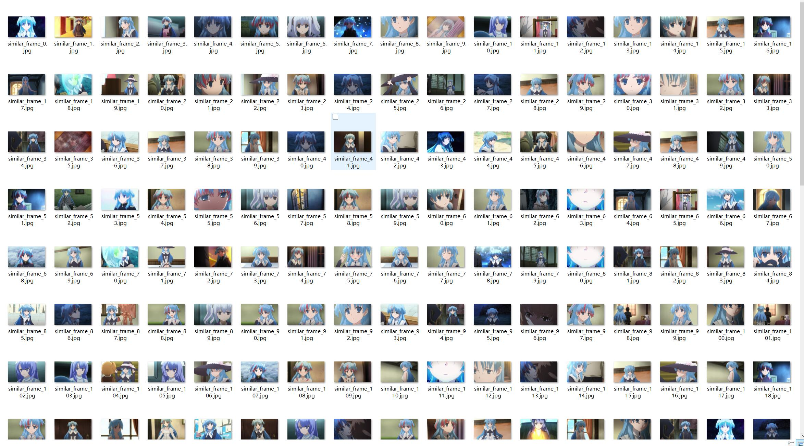

# anime_character_etraction

Fewshot Character Extraction From Anime Video With MultiModal Method

## Introdution

This is demo code in order to extract character from anime video with multimodal method under a oneshot setting.

With these multimodal prompt:
- text prompt ( describe the character with some words,like *one anime girl with long black hair and blue eyes*)
- image prompt ( one image of the character, selected from the anime video is best )
- ~audio prompt ( the audio segments of the character)~ NOT IMPLEMENTED FOR WITH THE ABOVE TWO METHOD THE RESULTS ARE GREAT ENOUGH

Besides the above multimodal prompt, I also add a `anime face detector` module from this [project](https://github.com/hysts/anime-face-detector) and it improves much.

## Results

### _Tokiwa Midori_ in ** Tamako Market and Tamako Love Story **

### _Chtholly Nota Seniorious_ in ** What Do You Do at the End of the World? Are You Busy? Will You Save Us? **

## Referrence

- [LAVIS - A Library for Language-Vision Intelligence](https://github.com/salesforce/LAVIS)
- [Anime Face Detector](https://github.com/hysts/anime-face-detector)
